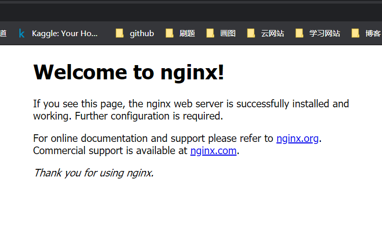
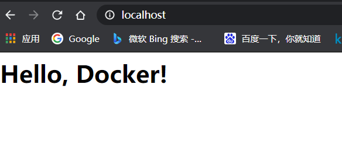
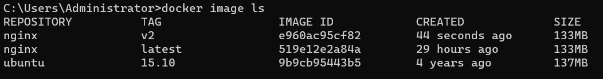
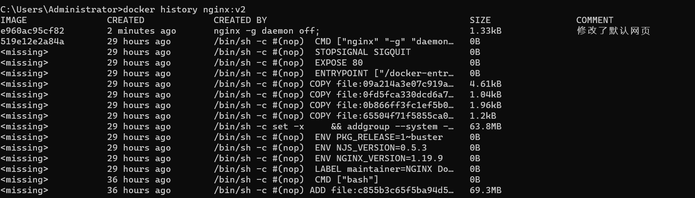

# 利用 commit 理解镜像构成

注意： `docker commit` 命令除了学习之外，还有一些特殊的应用场合，比如被入侵后保存现场等。但是，不要使用 `docker commit` 定制镜像，定制镜像应该使用 `Dockerfile` 来完成。如果你想要定制镜像请查看下一小节。

镜像是容器的基础，每次执行 `docker run` 的时候都会指定哪个镜像作为容器运行的基础。在之前的例子中，我们所使用的都是来自于 Docker Hub 的镜像。直接使用这些镜像是可以满足一定的需求，而当这些镜像无法直接满足需求时，我们就需要定制这些镜像。接下来的几节就将讲解如何定制镜像。

回顾一下之前我们学到的知识，镜像是多层存储，每一层是在前一层的基础上进行的修改；而容器同样也是多层存储，是在以镜像为基础层，在其基础上加一层作为容器运行时的存储层。

现在让我们以定制一个 Web 服务器为例子，来讲解镜像是如何构建的。

注意： `docker commit` 命令除了学习之外，还有一些特殊的应用场合，比如被入侵后保存现场等。但是，不要使用 `docker commit` 定制镜像，定制镜像应该使用 `Dockerfile` 来完成。如果你想要定制镜像请查看下一小节。

镜像是容器的基础，每次执行 `docker run` 的时候都会指定哪个镜像作为容器运行的基础。在之前的例子中，我们所使用的都是来自于 Docker Hub 的镜像。直接使用这些镜像是可以满足一定的需求，而当这些镜像无法直接满足需求时，我们就需要定制这些镜像。接下来的几节就将讲解如何定制镜像。

回顾一下之前我们学到的知识，镜像是多层存储，每一层是在前一层的基础上进行的修改；而容器同样也是多层存储，是在以镜像为基础层，在其基础上加一层作为容器运行时的存储层。

现在让我们以定制一个 Web 服务器为例子，来讲解镜像是如何构建的。

首先拉取`nginx`

```
docker pull nginx
```

然后创建容器

```
docker run --name webserver -d -p 80:80 nginx
```

这条命令会用 `nginx` 镜像启动一个容器，命名为 `webserver`，并且映射了 80 端口，这样我们可以用浏览器去访问这个 `nginx` 服务器。

如果是在本机运行的 Docker，那么可以直接访问：`http://localhost` ，如果是在虚拟机、云服务器上安装的 Docker，则需要将 `localhost` 换为虚拟机地址或者实际云服务器地址。

直接用浏览器访问的话，我们会看到默认的 Nginx 欢迎页面。



现在，假设我们非常不喜欢这个欢迎页面，我们希望改成欢迎 Docker 的文字，我们可以使用 `docker exec` 命令进入容器，修改其内容。

```bash
docker exec -it webserver bash
root@3729b97e8226:/# echo '<h1>Hello, Docker!</h1>' > /usr/share/nginx/html/index.html
root@3729b97e8226:/# exit
exit
```

我们以交互式终端方式进入 `webserver` 容器，并执行了 `bash` 命令，也就是获得一个可操作的 Shell。

然后，我们用 `<h1>Hello, Docker!</h1>` 覆盖了 `/usr/share/nginx/html/index.html` 的内容。

现在我们再刷新浏览器的话，会发现内容被改变了。



我们修改了容器的文件，也就是改动了容器的存储层。我们可以通过 `docker diff` 命令看到具体的改动。

```
$ docker diff webserver
C /run
A /run/nginx.pid
C /etc
C /etc/nginx
C /etc/nginx/conf.d
C /etc/nginx/conf.d/default.conf
C /var
C /var/cache
C /var/cache/nginx
A /var/cache/nginx/uwsgi_temp
A /var/cache/nginx/client_temp
A /var/cache/nginx/fastcgi_temp
A /var/cache/nginx/proxy_temp
A /var/cache/nginx/scgi_temp
C /root
A /root/.bash_history
C /usr
C /usr/share
C /usr/share/nginx
C /usr/share/nginx/html
C /usr/share/nginx/html/index.html
```

现在我们定制好了变化，我们希望能将其保存下来形成镜像。

要知道，当我们运行一个容器的时候（如果不使用卷的话），我们做的任何文件修改都会被记录于容器存储层里。而 Docker 提供了一个 `docker commit` 命令，可以将容器的存储层保存下来成为镜像。换句话说，就是在原有镜像的基础上，再叠加上容器的存储层，并构成新的镜像。以后我们运行这个新镜像的时候，就会拥有原有容器最后的文件变化。

`docker commit` 的语法格式为：

```
docker commit [选项] <容器ID或容器名> [<仓库名>[:<标签>]]
```

我们可以用下面的命令将容器保存为镜像：

```
docker commit --message "修改了默认网页" webserver nginx:v2
```

`--message` 则是记录本次修改的内容。这点和 `git` 版本控制相似，不过这里这些信息可以省略留空。

然后我们会得到

```
sha256:e960ac95cf82470e6d49f2c8bb82e0ecc2937cde7e0d91a0a8ddefad84b2b6f2
```

我们可以在 `docker image ls` 中看到这个新定制的镜像：



我们可以看到v2这个新的镜像

我们还可以用 `docker history` 具体查看镜像内的历史记录，如果比较 `nginx:latest` 的历史记录，我们会发现新增了我们刚刚提交的这一层。



新的镜像定制好后，我们可以来运行这个镜像。

```
docker run --name web2 -d -p 81:80 nginx:v2
```

这里我们命名为新的服务为 `web2`，并且映射到 `81` 端口。访问 `http://localhost:81` 看到结果，其内容应该和之前修改后的 `webserver` 一样。

至此，我们第一次完成了定制镜像，使用的是 `docker commit` 命令，手动操作给旧的镜像添加了新的一层，形成新的镜像，对镜像多层存储应该有了更直观的感觉。

## 慎用 `docker commit`

使用 `docker commit` 命令虽然可以比较直观的帮助理解镜像分层存储的概念，但是实际环境中并不会这样使用。

首先，如果仔细观察之前的 `docker diff webserver` 的结果，你会发现除了真正想要修改的 `/usr/share/nginx/html/index.html` 文件外，由于命令的执行，还有很多文件被改动或添加了。这还仅仅是最简单的操作，如果是安装软件包、编译构建，那会有大量的无关内容被添加进来，将会导致镜像极为臃肿。

此外，使用 `docker commit` 意味着所有对镜像的操作都是黑箱操作，生成的镜像也被称为 **黑箱镜像**，换句话说，就是除了制作镜像的人知道执行过什么命令、怎么生成的镜像，别人根本无从得知。而且，即使是这个制作镜像的人，过一段时间后也无法记清具体的操作。这种黑箱镜像的维护工作是非常痛苦的。

而且，回顾之前提及的镜像所使用的分层存储的概念，除当前层外，之前的每一层都是不会发生改变的，换句话说，任何修改的结果仅仅是在当前层进行标记、添加、修改，而不会改动上一层。如果使用 `docker commit` 制作镜像，以及后期修改的话，每一次修改都会让镜像更加臃肿一次，所删除的上一层的东西并不会丢失，会一直如影随形的跟着这个镜像，即使根本无法访问到。这会让镜像更加臃肿。